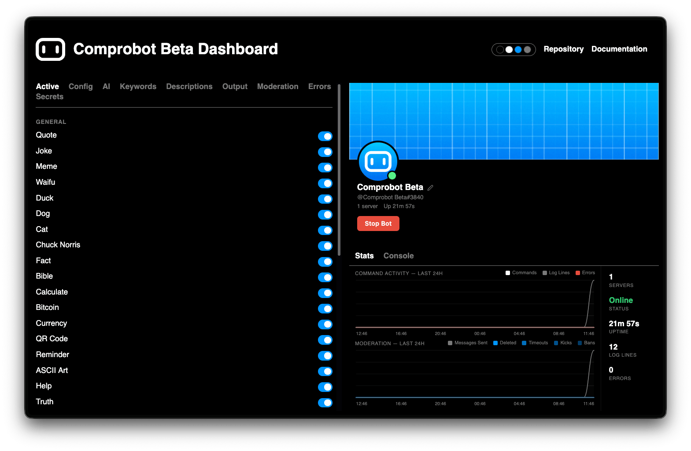

# Comprobot Dashboard

A web dashboard for [Comprobot](https://github.com/badluma/Comprobot) to start/stop the bot, edit config files, update the Discord profile, and monitor live logs and moderation stats.



## Requirements

- [Bun](https://bun.sh) v1.0+
- [Comprobot](https://github.com/badluma/Comprobot) installed and configured

## Install Bun

```sh
curl -fsSL https://bun.sh/install | bash
```

Windows:

```powershell
powershell -c "irm bun.sh/install.ps1 | iex"
```

## Install

```sh
bunx comprobot-dashboard
```

This installs the dashboard as a background service that starts automatically on login and restarts on crash.

| Platform | Mechanism |
|----------|-----------|
| macOS | launchd (`~/Library/LaunchAgents/`) |
| Linux | systemd user service (`~/.config/systemd/user/`) |
| Windows | Startup folder |

The dashboard runs at `http://localhost:7626`. To use a different port, set the `PORT` environment variable beforehand.

### Install from source

```sh
git clone https://github.com/badluma/Comprobot-Dashboard
cd Comprobot-Dashboard
bun install
```

## Run manually

```sh
bun start
```

For development with automatic reload on changes:

```sh
bun dev
```

# Disclaimer

This dashboard is entirely made by AI, so there might be bugs or unexpected behavior. If you are a web developer and want to help make a better version, feel free to contact me on [Discord](https://discord.gg/9M2agkVKun) or just create a pull request.
